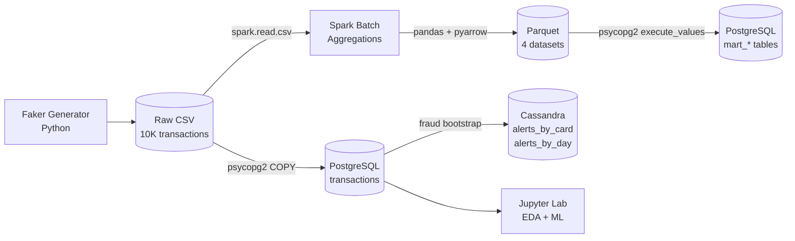

# 🛡️ Real-Time Fraud Detection Pipeline


Pipeline batch de détection de fraude bancaire, inspiré d'une architecture Lambda. Génère et analyse 10 000 transactions, identifie les patterns de fraude via Spark, et expose les résultats dans deux bases (PostgreSQL pour l'analytique, Cassandra pour les alertes temps réel) consommées par un notebook Jupyter d'EDA et de Machine Learning.

## 📊 Résultats clés

- **10 000 transactions** générées avec patterns de fraude réalistes (~1.5%)
- **5 pays à risque détectés** à 100% de fraude (CN, BR, NG, RU, RO)
- **Pic nocturne** identifié (1h–5h, jusqu'à 36% de fraude)
- **Modèle ML** : ROC AUC > 0.99, F1-score > 0.95 sur la classe "fraude"

Les captures d'écran voir le fichier : docs/images/

## 🏗️ Architecture



## 🛠️ Stack technique

| Techno | Rôle | Pourquoi |
|--------|------|----------|
| **Python** | Glue language | Standard data engineering |
| **Apache Spark 3.5** | Calcul distribué | Agrégations scalables (10K → 100M+) |
| **PostgreSQL 16** | Base relationnelle | ACID, requêtes analytiques complexes |
| **Apache Cassandra 4.1** | NoSQL wide-column | Écriture massive, modélisation orientée requêtes |
| **Apache Parquet** | Stockage colonnaire | Compression + lecture 10× plus rapide que CSV |
| **Docker Compose** | Infrastructure | Stack reproductible en une commande |
| **Jupyter + scikit-learn** | Analyse + ML | EDA visuel + classifieur supervisé |

## 📁 Structure du projet


fraud-detection-pipeline/
├── data/
│   ├── raw/                          # CSV générés (gitignore)
│   └── processed/                    # Parquets Spark (gitignore)
├── notebooks/
│   ├── 01_eda_fraud.ipynb            # Exploration & visualisations
│   └── 02_ml_model_fraud.ipynb       # Random Forest + Régression logistique
├── sql/
│   ├── schema_postgres.sql           # DDL table transactions
│   └── schema_cassandra.cql          # Keyspace + 2 tables d'alertes
├── src/
│   ├── ingestion/
│   │   ├── generate_transactions.py  # Faker, patterns de fraude injectés
│   │   ├── load_to_postgres.py       # COPY bulk depuis CSV
│   │   └── load_to_cassandra.py      # Bootstrap des alertes
│   └── processing/
│       ├── spark_aggregate.py        # 4 agrégats analytiques
│       └── load_data_mart.py         # Parquets → data mart Postgres
├── docker-compose.yml                # Postgres + Cassandra
├── requirements.txt
└── README.md


## 🚀 Quick start

### Prérequis
- Python 3.11+
- Java 17 (OpenJDK)
- Docker Desktop
- *(Windows uniquement)* `winutils.exe` + `hadoop.dll` dans `%HADOOP_HOME%\bin`, et Microsoft VC++ Redistributable

### Installation

```bash
git clone https://github.com/[TON_USERNAME]/fraud-detection-pipeline.git
cd fraud-detection-pipeline

python -m venv venv
.\venv\Scripts\Activate.ps1          # Windows
# source venv/bin/activate           # Linux/Mac
pip install -r requirements.txt
```

### Lancer la stack

```bash
# Démarrer Postgres + Cassandra
docker compose up -d

# Patch Postgres en MD5 (contournement bug JDBC SCRAM-SHA-256)
docker exec -e PGPASSWORD=fraud_password fraud-postgres \
  psql -U fraud_user -d fraud_db \
  -c "SET password_encryption='md5'; ALTER USER fraud_user WITH PASSWORD 'fraud_password';"

# Pipeline batch complet
python src/ingestion/generate_transactions.py
python src/ingestion/load_to_postgres.py
python src/ingestion/load_to_cassandra.py
python src/processing/spark_aggregate.py
python src/processing/load_data_mart.py

# Analyse interactive
jupyter lab
```

## 🤔 Décisions techniques (et arbitrages)

### 1. Hybride Spark + pandas pour l'écriture Parquet
Spark fait les transformations distribuées ; pandas+pyarrow écrit le Parquet final. Évite les dépendances Hadoop natives sur Windows (`winutils.exe`) tout en gardant la scalabilité de Spark sur l'amont. **Pattern courant** pour les agrégats de petite taille.

### 2. Cassandra : "une table par requête métier"
Deux tables (`alerts_by_card`, `alerts_by_day`) avec les mêmes données, partitionnées différemment. Dénormalisation assumée — pattern standard du NoSQL wide-column.

### 3. Authentification Postgres en MD5
Contournement d'un bug de négociation SCRAM-SHA-256 entre Spark JDBC 42.7 et Postgres 16. Documenté pour migration future vers SCRAM en environnement de prod où le driver serait à jour.

### 4. ML avec `class_weight="balanced"`
Dataset déséquilibré (1.5% de fraudes). Sans pondération, le modèle prédit toujours "non-fraude" → 98% d'accuracy mais 0% de recall. La pondération recale la loss function pour pénaliser fortement les fraudes manquées.

## 🔮 Améliorations futures (v2)
- **Streaming temps réel** avec Spark Structured Streaming + Kafka
- **Orchestration** via Airflow (DAG quotidien des agrégats batch)
- **Containerisation Spark** (élimine les soucis winutils/JDBC Windows)
- **Hyperparameter tuning** avec GridSearchCV + cross-validation
- **Explicabilité** du modèle avec SHAP
- **Monitoring** des dérives du modèle (drift detection)
